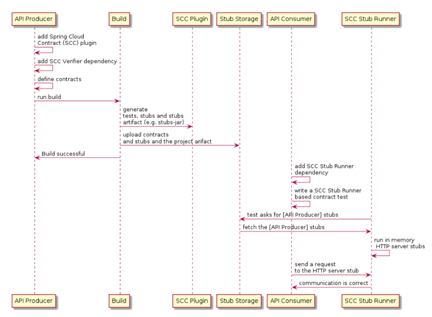

# spring-cloud-contract
스프링 클라우드 컨트랙트 예제코드
## 프로젝트 구성 
1. Build Tool : Gradle
2. 모듈
   1. Producer : 특정 API를 제공하는 Producer. 컨슈머에게 계약에 따라 stub을 제공한다.
   2. Consumer : 특정 API를 소비한는 Consumer. 프로듀서가 제공하는 stub을 기반으로 테스트 작성

## Spring Cloud Contract workflow
\
출처 : https://docs.spring.io/spring-cloud-contract/docs/current/reference/html/getting-started.html#getting-started-three-second-tour

## 참고자료
스프링 클라우드 Contract 는 상당히 다양한 Feature들을 제공한다. 예를들어 Contract 작성법만 해도 groovy, yaml, java, kotlin으로 작성하는 방법을 제공한다.\
또한 다양한 스프링 프로젝트들 Integration을 제공하기 때문에 필요한 기능이 있을때 공식문서를 확인하여 적용하는 방법으로 접근하는게 좋아보인다.
- [**getting-started**](https://docs.spring.io/spring-cloud-contract/docs/current/reference/html/getting-started.html#getting-started)
- [**Using Spring Cloud Contract**](https://docs.spring.io/spring-cloud-contract/docs/current/reference/html/using.html#flows-cdc-contracts-stubs-git)
- [**Spring Cloud Contract With Gradle**](https://docs.spring.io/spring-cloud-contract/docs/current/reference/html/gradle-project.html)
- [**How To Guides**](https://docs.spring.io/spring-cloud-contract/docs/current/reference/html/howto.html#howto) 
